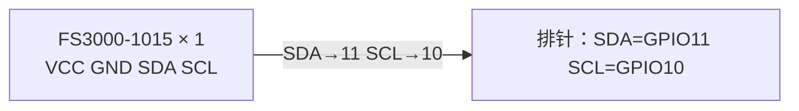

# 硬件设备安装指南（图文）

本文档逐步说明骑行气动测试装置的硬件安装：从拆包验收到整车装车、通电自检。
适用版本：**双 FS3000 V 形探针主工程**；单传感器简化版见文末「附录 A」。

> 说明：本文档中的接线拓扑图（Mermaid）、装配示意图（ASCII）为**示意**，引脚号以 `config.h` 与官方原理图为准。

---

## 0. 物料清单

| 序号 | 物料 | 数量 | 备注 |
|---|---|---|---|
| 1 | Waveshare ESP32-S3-Touch-LCD-2.8 | 1 | 主板，含屏 + TF 卡槽 |
| 2 | rtrobot FS3000-1015 风速传感器板 | 2 | I2C 地址固定 0x28 |
| 3 | BME280 模块（可选） | 1 | 测温度/气压算空气密度 |
| 4 | TF 卡（FAT32） | 1 | 记录 CSV 日志 |
| 5 | 探杆 + 车把固定座 | 1 套 | 前伸 20~30cm，见第 4 节 |
| 6 | 探针头支架（V 形 45°） | 1 | 见《外壳方案分析》 |
| 7 | 主机盒 + 锂电池（3.7V 1000mAh+） | 1 | 建议带升压/保护板 |
| 8 | 杜邦线/硅胶线（≥26AWG） | 若干 | 传感器接线 |

---

## 1. 主板准备

1. 用 Type-C 连接电脑，确认进入下载模式（按住 BOOT 再插线可强制进入）。
2. 按项目 README 烧录固件（双传感器工程：`code/` 目录；先烧单传感器验证：`code/single-fs3000/`）。
3. 烧录后 LCD 显示 "AERO PROBE"，串口输出 `Probe L:OK R:OK` 即主板正常。

---

## 2. 接线（关键步骤）

> ⚠️ **两片 FS3000 地址都是 0x28，必须分两条 I2C 总线**，否则冲突无法读取。

```mermaid
graph LR
  subgraph 探针头（前伸端）
    FS1["FS3000 #1 左臂<br/>VCC GND SDA SCL"]
    FS2["FS3000 #2 右臂<br/>VCC GND SDA SCL"]
  end
  subgraph 主板 ESP32-S3-Touch-LCD-2.8
    H1["排针：SDA=GPIO11 SCL=GPIO10"]
    H2["12针排针：IO15(SDA) IO18(SCL)"]
    PM["BLE 功率计（无线）"]
  end
  FS1 -->|"SDA→11  SCL→10"| H1
  FS2 -->|"SDA→15  SCL→18"| H2
  PM -. "BLE 0x1818" .-> 主板
```

| 器件 | 引脚 | 接主板 | 线色建议 |
|---|---|---|---|
| FS3000 #1 | VCC | 3V3 | 红 |
| | GND | GND | 黑 |
| | SDA | **GPIO11**（排针 SDA） | 绿 |
| | SCL | **GPIO10**（排针 SCL） | 黄 |
| FS3000 #2 | VCC | **3V3（12 针排针 3V3 孔直插，无需飞线）** | 红 |
| | GND | GND（12 针排针） | 黑 |
| | SDA | **GPIO15**（12 针排针 IO15） | 蓝 |
| | SCL | **GPIO18**（12 针排针 IO18） | 白 |
| BME280（可选） | SDA | GPIO11（与 #1 同总线） | 绿 |
| | SCL | GPIO10（与 #1 同总线） | 黄 |

接线后检查：`#1 的 SDA/SCL 不能与 #2 混接`；所有 GND 共地；线长尽量短且绞合。

### 2.1 实物照片接线核对（2026-10-02，已购实物）

以 `img/` 目录下 4 张实物照片（IMG_0953~0956）为准核对，接线方案与上表一致，并补充三个实物细节：

| 照片 | 实物 | 与假设的差异 |
|---|---|---|
| IMG_0953/0954 | Waveshare ESP32-S3-Touch-LCD-2.8 主板（蓝 PCB） | 丝印确认 I2C 排针（SCL/SDA/3V3/GND）、UART 排针（RXD/TXD/3V3/GND）、12 针排针（IO15/IO18/RXD/TXD/SDA/SCL/**3V3**/GND/VBus/D+/D-/GND）、18650 电池座、QC 快充、带喇叭（PCM5101A+APA2068） |
| IMG_0955 | FS3000 风速计模块 | 4 个**焊盘**（非排针），丝印 SDA/SCL/VCC/GND，两个安装孔 |
| IMG_0956 | FS3000-1015 芯片 | 芯片丝印 "1015"，白色向上箭头 = 气流方向 |

**实物决定的三个关键点：**

1. **#2 的 3V3 直插 12 针排针即可，无需飞线**：放大丝印确认 12 针完整为 `IO15 IO18 RXD TXD SDA SCL 3V3 GND VBUS D+ D- GND`——**含 3V3**。FS3000 #2 的 VCC 直接插 12 针排针 3V3 孔（接线图红虚线飞线为早期误判，已作废），GND 就近用 12 针排针 GND。
2. **VBUS(5V) 严禁接传感器**：FS3000 VDD 上限 3.6V，接 VBUS 会烧芯片。12 针排针的 VBUS 仅用于 USB 场景，本工程不用。
3. **传感器板是焊盘，需要焊接**：4 个 PAD 焊 2.54mm 公排针（FS3000 侧保持 2.54mm 标准杜邦）。**注意主板侧排针间距实测为 1.27mm（2026-10-03 卡尺实测：插座宽 6mm、针间距 ~1.27mm），普通杜邦母头插不进**——主板侧请购买「**1.27mm 公头 → 2.54mm 母头**」转接杜邦线（1.27 公头端套主板排针、2.54 母头端套 FS3000 板公排针，共 4 根 GND/3V3/SDA/SCL）；或直接焊线 + 热缩管。焊盘顺序按丝印 SDA/SCL/VCC/GND（IMG_0955）。

接线示意图（保存在 `img/wiring-diagram.svg`，可用浏览器打开）：

```
img/wiring-diagram.svg   ← 完整接线图（主板排针 ↔ 两片 FS3000，含线色）
```

固件 `config.h` 与实物核对结果一致，**无需改代码**：`Wire`(GPIO11/10) 挂 #1，`Wire1`(GPIO15/18) 挂 #2。

---

## 3. 探针头组装（V 形 ±45°）

```text
俯视图（示意）：

              车头前进方向 →
                 ▲
            ╱      ╲
     FS1 ╱  45°  45°  ╲ FS2
       ╱                ╲
      ◄ 左右张开 5~8cm  ►
          ╲            ╱
            ╲        ╱
              探杆（Φ≤10mm 圆杆）
                │
             车把固定座
```

步骤：
1. 两片传感器**同点安装**在探针头支架上，传感器轴各与车头成 ±45°，箭头（气流方向）朝前。
2. 两臂间距 5~8 cm，避免热膜互扰（间距过小会导致相互加热误读）。
3. 支架尽量细长、截面圆滑；不要用宽扁板正对来流（会挡风并产生分离流，见《外壳方案分析》）。
4. 传感器风口保持裸露，不要加网/罩遮挡（如需防雨选导流罩方案 B）。

---

## 4. 探杆与整车安装

```text
侧视图（示意）：

        头盔         探针头（自由来流区）
      ◉ 头部    ←    FS1  FS2
        │              ╲ ╱
     车手身体          探杆前伸 20~30cm
        │              │
      车把 == 固定座 == ═╧═   ← 码表座/把立位置
```

要点：
1. **前伸 20~30 cm**，让探针头伸出车手头盔/身体尾流区，处于自由来流。
2. 安装高度与肩部大致齐平或略高；避免紧贴车把（把立上方回流区会压低读数）。
3. 探杆用细圆杆（碳纤维/铝/打印件，Φ6~10mm），截面越小对气流干扰越小。
4. 固定座可借用码表架（K-Edge/国产码表座）或把立夹具；安装后用手摇晃确认无共振。
5. 线束沿探杆下沿走，用扎带/热缩管固定，留出转向余量，防止拉扯插头。

---

## 5. 主机盒与供电

1. 主板装入主机盒（方案见《外壳方案分析》），屏幕朝上或朝车手。
2. 供电：建议 3.7V 锂电池 + 5V 升压模块（主板 5V 排针），或移动电源。
3. 电池与主板之间加开关；TF 卡槽、USB 口位置预留开口。
4. 主机盒固定位置推荐：**把立/上管**，重心低、不挡腿。
5. 雨天骑行务必用防水盒或加塑料袋密封（FS3000 风口本身不防水）。

---

## 6. 通电自检清单

| # | 检查项 | 现象（正常） |
|---|---|---|
| 1 | LCD 上电 | 显示 "AERO PROBE" |
| 2 | 串口探针状态 | `Probe L:OK R:OK` |
| 3 | 零风读数 | 静止时两片 ~0.0 m/s（≤0.3 可接受） |
| 4 | 手扇/吹风 | 对应臂读数上升，偏航角方向正确 |
| 5 | BLE 功率计 | 屏幕 "BLE OK"，踏频/功率跳动 |
| 6 | TF 卡 | 屏幕 "SD OK"，`fs_*.csv` 每秒新增一行 |
| 7 | 装车慢骑 | 屏幕 Vair≈车速±环境风，Yaw 随车头摆角变化 |

> 常见问题：两片读数都卡 0 → 查 I2C 地址冲突/接线；只一片 0 → 查该片供电与 SDA/SCL；读数乱跳 → 检查线长/绞合/共地，采样间隔保持 ≥125ms。

---

## 附录 A：单 FS3000 简化版接线



| 引脚 | 接主板 | 说明 |
|---|---|---|
| VCC | 3V3 | 3.3V 直供 |
| GND | GND | 共地 |
| SDA | GPIO11 | I2C 数据 |
| SCL | GPIO10 | I2C 时钟 |

固件：`code/single-fs3000/single_fs3000.ino`，烧录后屏幕大字显示风速 m/s，并显示原始计数与校验错误次数，用于模块验证。
